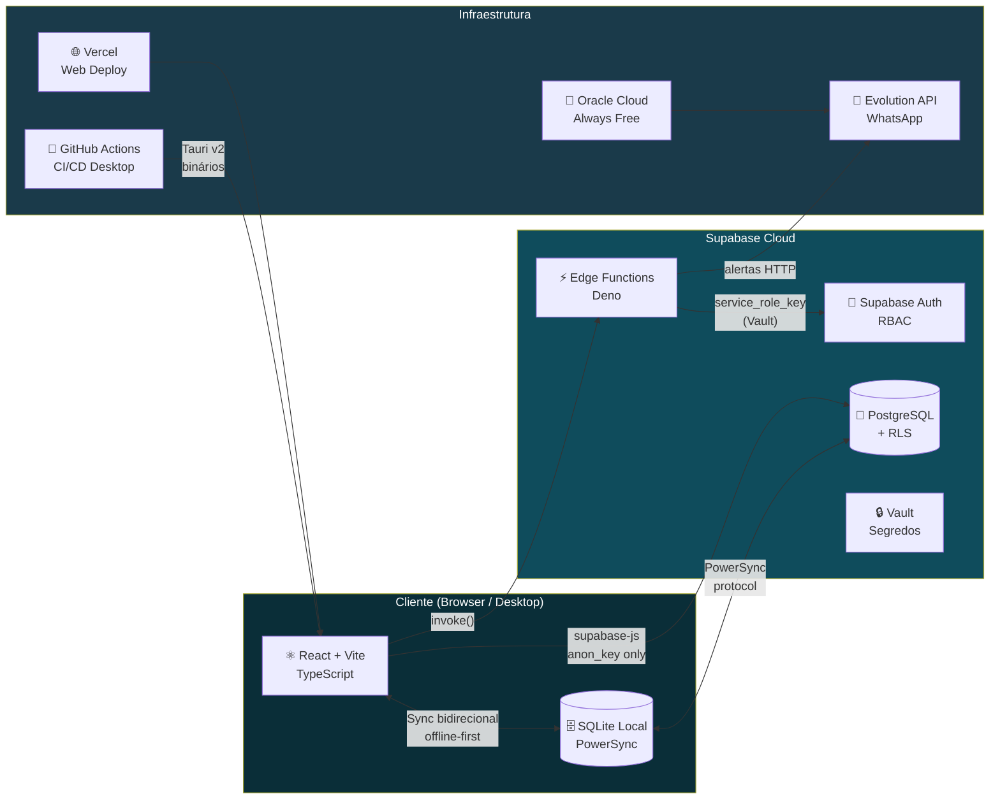
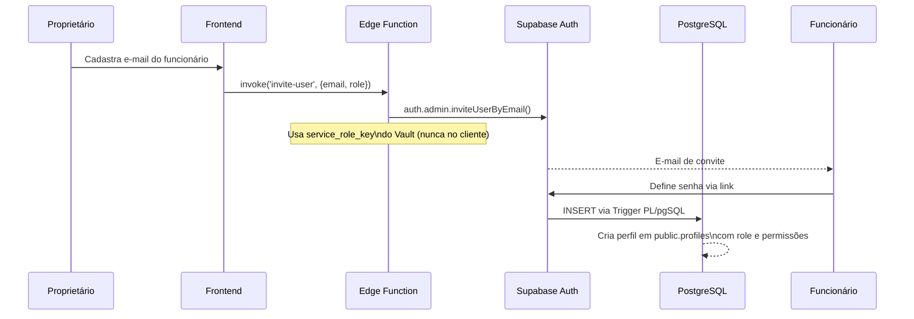
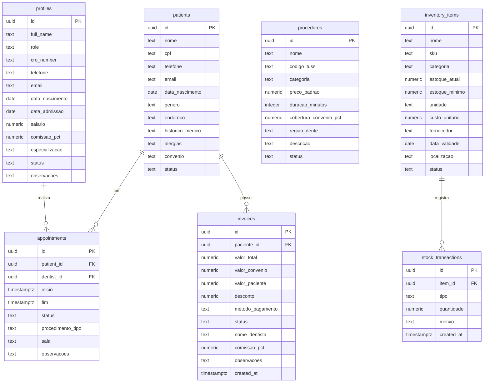

<div align="center">


# BiteByte — OdontoERP

**Sistema de Gestão Clínica Odontológica · Full-Stack · Offline-First**

[](https://reactjs.org/)
[](https://www.typescriptlang.org/)
[](https://vitejs.dev/)
[](https://supabase.com/)
[](https://www.postgresql.org/)
[](https://tailwindcss.com/)
[](https://tauri.app/)
[](https://vercel.com/)

[](LICENSE)
[]()
[23-Lambda_JC23_Data_Systems-0F4C5C?style=flat-square)]()

> **Repositório de avaliação técnica** - versão higienizada sem credenciais ou dados sensíveis.  
> O sistema completo é para uso interno em ambiente clínico.

</div>

---

## 📋 Índice

- [Sobre o Projeto](#-sobre-o-projeto)
- [Arquitetura](#-arquitetura)
- [Módulos da Aplicação](#-módulos-da-aplicação)
- [Stack Tecnológica](#-stack-tecnológica)
- [Banco de Dados (Schema)](#-banco-de-dados-schema)
- [Segurança e RBAC](#-segurança-e-rbac)
- [Screenshots](#-screenshots)
- [Setup Local](#-setup-local)
- [Deploy](#-deploy)
- [Estrutura do Projeto](#-estrutura-do-projeto)
- [Roadmap](#-roadmap)

---

## 🦷 Sobre o Projeto

O **BiteByte OdontoERP** é uma aplicação web full-stack para gestão operacional de clínicas odontológicas, desenvolvida com foco em três pilares:

| Pilar | Descrição |
|---|---|
| **Offline-First** | Opera sem internet via SQLite local (PowerSync) sincronizado com PostgreSQL |
| **Segurança Industrial** | Row Level Security no banco + RBAC com 6 perfis + convites via Edge Function |
| **Custo Zero** | Stack 100% em free tiers — Supabase, Vercel, Oracle Cloud Always Free |

### Funcionalidades principais

- 📊 **Dashboard** com métricas em tempo real (receita, consultas, alertas de estoque)
- 📅 **Agenda** semanal com gestão de status de consultas
- 👥 **Pacientes** com prontuário médico protegido por RLS
- 📋 **Procedimentos** com catálogo TUSS/ANS e importação via CSV
- 💰 **Financeiro** com controle de faturas, convênio e comissão de dentistas
- 📦 **Estoque** com trigger de banco e alertas automáticos via WhatsApp
- 👤 **Equipe/RH** com convite seguro e inativação imediata de acesso

---

## 🏗️ Arquitetura



### Fluxo de Autenticação



---

## 📦 Módulos da Aplicação

### Dashboard
Cards de métricas com receita mensal (`Recharts`), consultas do dia, alertas de estoque abaixo do mínimo e agenda compacta.
> **RLS:** Receita visível apenas para `proprietario` e `gerente`. Demais perfis recebem zero na query SQL.

### Agenda (`appointments`)
Calendário semanal com slots coloridos por status. CRUD completo com controle de sala, dentista responsável e ciclo de status.

| Status | Descrição |
|---|---|
| `agendado` | Consulta marcada |
| `confirmado` | Paciente confirmou presença |
| `em_atendimento` | Consulta em curso |
| `concluido` | Atendimento finalizado |
| `cancelado` / `nao_compareceu` | Ocorrências negativas |

### Pacientes (`patients`)
Cadastro completo com CPF, convênio, histórico médico e alergias.
> **RLS:** `historico_medico` e `alergias` bloqueados para perfis administrativos. Apenas dentistas e proprietário têm acesso de leitura.

### Procedimentos (`procedures`)
Catálogo com código TUSS/ANS, categoria, preço padrão e duração. Suporte a importação via CSV da **Tabela 22 da ANS**.

### Financeiro (`invoices`)
Controle completo de faturas com divisão convênio/paciente, comissão de dentista, múltiplos métodos de pagamento e ciclo de status (`pendente → parcial → pago / vencido`).
> **RLS:** Acesso bloqueado para `dentista` e `auxiliar`. Somente `proprietario` e `financeiro`.

### Estoque (`inventory_items` + `stock_transactions`)
Controle de estoque com **trigger PL/pgSQL** que atualiza `estoque_atual` automaticamente a cada transação. Uma **Edge Function** verifica diariamente itens abaixo de `estoque_minimo` e dispara alertas via Evolution API (WhatsApp).

### Equipe/RH (`profiles`)
Gestão de membros com convite por e-mail via Edge Function. Inativação de perfil remove a sessão do usuário no `auth.users` imediatamente.

---

## 🛠️ Stack Tecnológica

### Frontend & Desktop
| Tecnologia | Uso |
|---|---|
| **React 18 + Vite** | SPA base da aplicação |
| **TypeScript** | Tipagem estática |
| **Tailwind CSS** | Estilização utility-first |
| **shadcn/ui** | Componentes UI (Radix primitivos) |
| **Recharts** | Gráficos do Dashboard |
| **Zustand** | Gerenciamento de estado global |
| **TanStack Query** | Cache e sincronização de dados remotos |
| **Zod** | Validação de schemas de formulários |
| **React Hook Form** | Gestão de formulários |
| **Tauri v2** | Empacotamento em binários desktop (Windows/macOS) |

### Backend & Banco de Dados
| Tecnologia | Uso |
|---|---|
| **Supabase** | BaaS — Auth, Database, Storage, Edge Functions |
| **PostgreSQL** | Banco de dados relacional principal |
| **PL/pgSQL** | Triggers e Functions no banco |
| **Row Level Security** | Controle de acesso a nível de linha |
| **Supabase Auth** | Autenticação com convite (`inviteUserByEmail`) |
| **Edge Functions (Deno)** | Lógica serverless segura (convites, alertas) |
| **PowerSync** | Sincronização SQLite local ↔ PostgreSQL (Offline-First) |

### Infraestrutura & Deploy
| Tecnologia | Uso |
|---|---|
| **Vercel** | Deploy da versão web |
| **GitHub Actions** | CI/CD — compilação e release dos binários desktop |
| **Oracle Cloud Always Free** | Auto-hospedagem da Evolution API (São Paulo) |
| **Supabase Vault** | Armazenamento seguro de segredos (service_role_key) |

### Integrações
| Tecnologia | Uso |
|---|---|
| **Evolution API** | Automação de WhatsApp para alertas de estoque |
| **Tabela TUSS/ANS** | Catálogo padrão de procedimentos odontológicos |

---

## 🗄️ Banco de Dados (Schema)



---

## 🔐 Segurança e RBAC

Este projeto implementa segurança em **múltiplas camadas**:

### Princípios Adotados

| Princípio | Implementação |
|---|---|
| **Minimização de Superfície** | Frontend nunca cria usuários diretamente. Sempre via Edge Function |
| **Menor Privilégio** | RLS em todas as tabelas. Frontend assume retorno vazio se não autorizado |
| **Gestão de Segredos** | `service_role_key` somente no Vault. Cliente usa apenas `anon_key` |
| **Sem Hardcode** | Credenciais exclusivamente via `import.meta.env.VITE_*` |

### Perfis de Acesso (RBAC)

```
proprietario  ──→  Acesso total (financeiro, RLS admin, convites)
gerente       ──→  Dashboard financeiro + gestão de agenda e equipe
dentista      ──→  Agenda própria + prontuários dos seus pacientes
recepcionista ──→  Agenda completa + cadastro de pacientes
auxiliar      ──→  Leitura de agenda + estoque
financeiro    ──→  Módulo financeiro + relatórios
```

### Regras RLS por Módulo

| Tabela | Regra |
|---|---|
| `invoices` | SELECT/INSERT/UPDATE bloqueado para `dentista` e `auxiliar` |
| `patients.historico_medico` | Leitura bloqueada para perfis administrativos |
| `profiles.salario` | Visível apenas para `proprietario` |
| `appointments` | DELETE restrito a `proprietario` e `recepcionista` |

---

## 📸 Screenshots

> As imagens abaixo mostram a interface da versão de desenvolvimento.

### Dashboard


### Agenda Semanal


### Módulo Financeiro


### Gestão de Estoque


### Cadastro de Pacientes


### Catálogo de Procedimentos


> 📄 Documentação visual completa disponível em [`docs/BiteByte_OdontoERP_Portfolio.pdf`](docs/BiteByte_OdontoERP_Portfolio.pdf)

---

## ⚙️ Setup Local

### Pré-requisitos

- [Node.js](https://nodejs.org/) >= 18
- [npm](https://www.npmjs.com/) ou [pnpm](https://pnpm.io/)
- Conta no [Supabase](https://supabase.com/) (Free Tier)
- *(Opcional para desktop)* [Rust](https://www.rust-lang.org/) + [Tauri CLI](https://tauri.app/v1/guides/getting-started/prerequisites)

### 1. Clone o repositório

```bash
git clone https://github.com/MrCampanatti/bitebyte-demo.git
cd bitebyte-demo
```

### 2. Instale as dependências

```bash
npm install
```

### 3. Configure as variáveis de ambiente

Crie um arquivo `.env.local` na raiz do projeto:

```env
# Supabase — obtenha em: supabase.com > Project Settings > API
VITE_SUPABASE_URL=https://SEU_PROJECT_ID.supabase.co
VITE_SUPABASE_ANON_KEY=sua_anon_key_publica_aqui

# PowerSync — obtenha em: powersync.com > Project Settings
VITE_POWERSYNC_URL=https://SEU_ID.powersync.journeyapps.com
```

> ⚠️ **Nunca** use ou exponha a `service_role_key` no frontend.  
> Ela pertence exclusivamente ao **Supabase Vault**, consumida pelas Edge Functions.

### 4. Configure o banco de dados no Supabase

Execute as migrations SQL na ordem:

```bash
# Acesse o SQL Editor no dashboard do Supabase e execute:
# supabase/migrations/001_create_tables.sql
# supabase/migrations/002_rls_policies.sql
# supabase/migrations/003_triggers.sql
# supabase/migrations/004_edge_functions_setup.sql
```

### 5. Inicie em modo desenvolvimento

```bash
npm run dev
```

A aplicação estará disponível em `http://localhost:5173`

### 6. *(Opcional)* Build para desktop com Tauri

```bash
npm run tauri build
```

Os binários serão gerados em `src-tauri/target/release/bundle/`.

---

## 🚀 Deploy

### Web (Vercel)

```bash
# Build de produção
npm run build

# Deploy via Vercel CLI
vercel --prod
```

Configure as variáveis de ambiente no painel da Vercel espelhando o `.env.local`.

### Desktop (GitHub Actions)

O workflow `.github/workflows/release.yml` compila automaticamente os binários Windows e macOS em cada nova tag:

```bash
git tag v1.0.0
git push origin v1.0.0
# → GitHub Actions dispara o build Tauri
# → Binários publicados como GitHub Release
```

---

## 📁 Estrutura do Projeto

```
bitebyte-demo/
├── src/
│   ├── api/
│   │   └── supabase.ts          # Cliente Supabase configurado
│   ├── components/
│   │   └── ui/                  # Componentes shadcn/ui (não modificar)
│   ├── pages/
│   │   ├── Dashboard.tsx
│   │   ├── Appointments.tsx
│   │   ├── Patients.tsx
│   │   ├── Procedures.tsx
│   │   ├── Financial.tsx
│   │   ├── Inventory.tsx
│   │   └── Staff.tsx
│   ├── hooks/                   # Custom hooks (useAuth, useRBAC...)
│   ├── store/                   # Zustand stores
│   └── lib/
│       └── utils.ts
├── supabase/
│   ├── migrations/              # Scripts SQL de estrutura
│   └── functions/               # Edge Functions (Deno)
│       ├── invite-user/
│       └── stock-alert/
├── src-tauri/                   # Configuração Tauri (desktop)
├── docs/
│   └── screenshots/             # Imagens da interface
└── .github/
    └── workflows/
        └── release.yml          # CI/CD para binários desktop
```

---

## 🗺️ Roadmap

- [x] Módulo Dashboard com métricas e gráficos
- [x] Módulo Agenda com calendário semanal
- [x] Módulo Pacientes com prontuário protegido
- [x] Módulo Procedimentos com catálogo TUSS
- [x] Módulo Financeiro com controle de faturas
- [x] Módulo Estoque com trigger automático
- [x] Módulo Equipe com RBAC e convite seguro
- [x] Autenticação com Row Level Security completo
- [ ] Sincronização Offline-First via PowerSync
- [ ] Build desktop com Tauri v2
- [ ] Alertas WhatsApp via Evolution API
- [ ] Deploy OTA via GitHub Actions
- [ ] Testes E2E com Playwright

---

## 📄 Licença

Distribuído sob a licença MIT. Veja [`LICENSE`](LICENSE) para mais informações.

---

<div align="center">

**λ(jc)23 · Lambda JC23 Data Systems**

[](https://sites.google.com/view/porfliofilipecampanati/início)
[](https://github.com/MrCampanatti)

*Este repositório é uma versão higienizada para avaliação técnica.*  
*Dados sensíveis, credenciais e informações de pacientes foram removidos.*

</div>
